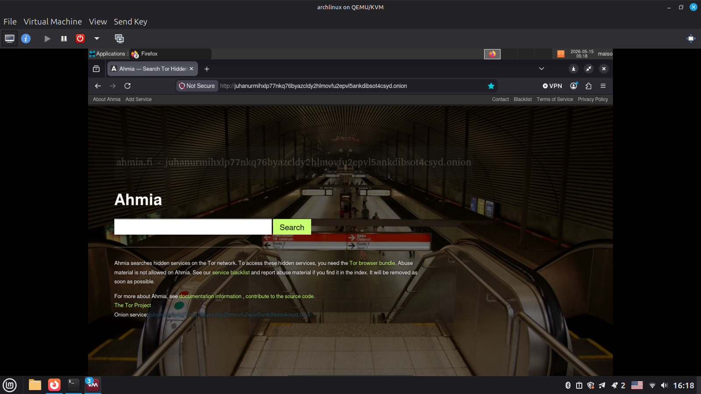
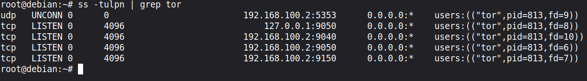
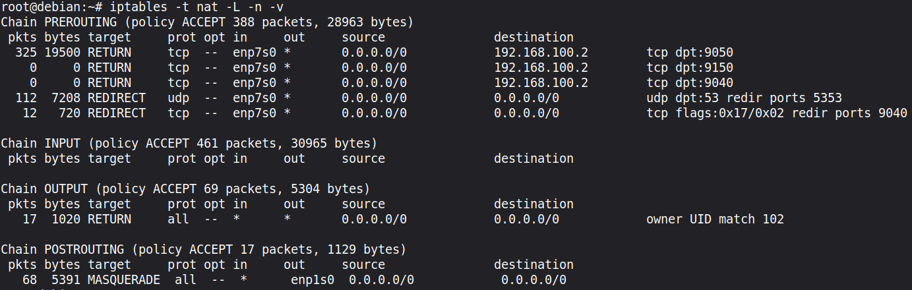

# 🧅 tor-proxy

> A transparent Tor gateway built with two VMs — all traffic from the client is automatically routed through Tor, no client-side configuration needed.


---

## 📸 Screenshots

| Tor Check | Onion Site |
|-----------|------------|
|  |  |

| Listening Ports | iptables Rules |
|-----------------|----------------|
|  |  |

---

## 🗺️ Network Diagram

```
┌──────────────────────────────────────────────────────────────────┐
│                        Linux Mint (Host)                         │
│                        QEMU/KVM + virt-manager                   │
│                                                                  │
│   ┌─────────────────────┐       ┌──────────────────────────┐    │
│   │    Arch Linux       │       │     Debian 13            │    │
│   │    (Client)         │       │     (Gateway)            │    │
│   │                     │  LAN  │                          │    │
│   │  192.168.100.51 ◄───┼───────┼─► 192.168.100.2 (LAN)   │    │
│   │                     │       │   192.168.122.31 (WAN)   │    │
│   │  All traffic goes   │       │                          │    │
│   │  through Tor        │       │   Tor 0.4.9.6            │    │
│   │  automatically      │       │   iptables redirect      │    │
│   └─────────────────────┘       └────────────┬─────────────┘    │
│                                              │                   │
└──────────────────────────────────────────────┼───────────────────┘
                                               │ WAN (NAT)
                                               ▼
                                        🌐 Internet
                                        (via Tor Network)
```

**Traffic flow:**
```
Client (Arch) → iptables PREROUTING → Tor TransPort:9040 → Tor Network → Internet
Client DNS    → iptables PREROUTING → Tor DNSPort:5353   → Tor Network → resolved
```

---

## ⚙️ How It Works

### Gateway (Debian)
- Runs **Tor** with `TransPort` and `DNSPort` exposed on the LAN interface
- **iptables** intercepts all TCP traffic and DNS queries from the client and redirects them into Tor
- Acts as the default gateway and DHCP server for the LAN

### Client (Arch Linux)
- Connected only to the LAN — has no direct internet access
- Receives gateway IP and DNS server via DHCP automatically
- Zero configuration needed — all traffic goes through Tor transparently

---

## 🛠️ Requirements

- Linux host with **QEMU/KVM** and **virt-manager**
- Two virtual machines:
  - **Gateway VM**: Debian 13, 2 NICs (WAN + LAN)
  - **Client VM**: Arch Linux, 1 NIC (LAN only)
- Two libvirt networks:
  - `default` (NAT) — for gateway WAN access
  - `inner-network` (Isolated) — for LAN between VMs

> ⚠️ **Important**: Make sure your isolated libvirt network (`virbr1`) does NOT use the same IP as your gateway VM. This caused a major routing bug during development — see [Troubleshooting](#-troubleshooting).

---

## 🚀 Setup

### 1. Gateway VM — Network Interfaces

`/etc/network/interfaces`:
```
auto enp7s0
iface enp7s0 inet static
    address 192.168.100.2
    netmask 255.255.255.0

auto enp1s0
iface enp1s0 inet dhcp
```

Enable IP forwarding:
```bash
echo "net.ipv4.ip_forward=1" >> /etc/sysctl.d/99-tor-gateway.conf
echo "net.ipv4.conf.enp7s0.rp_filter=0" >> /etc/sysctl.d/99-tor-gateway.conf
sysctl --system
```

### 2. Gateway VM — Install Tor & DHCP server

```bash
apt install tor isc-dhcp-server -y
```

### 3. Gateway VM — Tor Configuration

`/etc/tor/torrc`:
```
# SOCKS proxy for LAN clients
SocksPort 192.168.100.2:9050
SocksPolicy accept 192.168.100.0/24
SocksPolicy accept 127.0.0.1
SocksPolicy reject *

# Transparent proxy — iptables redirects all TCP here
TransPort 192.168.100.2:9040

# DNS through Tor — prevents DNS leaks
DNSPort 192.168.100.2:5353

# Local SOCKS for the gateway itself
SocksPort 127.0.0.1:9050
```

```bash
systemctl enable --now tor
```

### 4. Gateway VM — DHCP Server

`/etc/dhcp/dhcpd.conf`:
```
default-lease-time 600;
max-lease-time 7200;

subnet 192.168.100.0 netmask 255.255.255.0 {
    range 192.168.100.50 192.168.100.100;

    # Default gateway
    option routers 192.168.100.2;

    option subnet-mask 255.255.255.0;
    option broadcast-address 192.168.100.255;

    # DNS through Tor — iptables redirects port 53 → 5353
    option domain-name-servers 192.168.100.2;
}
```

```bash
systemctl enable --now isc-dhcp-server
```

### 5. Gateway VM — iptables Rules

```bash
# Don't redirect traffic destined for Tor ports themselves
iptables -t nat -I PREROUTING 1 -i enp7s0 -d 192.168.100.2 -p tcp --dport 9050 -j RETURN
iptables -t nat -I PREROUTING 2 -i enp7s0 -d 192.168.100.2 -p tcp --dport 9040 -j RETURN

# Redirect DNS (port 53) → Tor DNSPort (5353)
iptables -t nat -A PREROUTING -i enp7s0 -p udp --dport 53 -j REDIRECT --to-ports 5353

# Redirect all TCP → Tor TransPort (9040)
iptables -t nat -A PREROUTING -i enp7s0 -p tcp --syn -j REDIRECT --to-ports 9040

# Don't intercept Tor's own traffic (uid 102 = debian-tor)
iptables -t nat -A OUTPUT -m owner --uid-owner 102 -j RETURN

# NAT for outbound internet traffic
iptables -t nat -A POSTROUTING -o enp1s0 -j MASQUERADE

# Allow forwarding
iptables -A FORWARD -i enp7s0 -j ACCEPT
```

Save rules permanently:
```bash
apt install iptables-persistent -y
iptables-save > /etc/iptables/rules.v4
```

### 6. Client VM — No Configuration Needed

The client receives everything via DHCP. Just verify:
```bash
ip route show        # default via 192.168.100.2
cat /etc/resolv.conf # nameserver 192.168.100.2
```

---

## ✅ Verification

**On the client (Arch Linux):**
```bash
# Check transparent proxy works
curl https://check.torproject.org | grep -o "Congratulations\|Sorry"
# Expected: Congratulations

# Check .onion sites work (via explicit SOCKS)
curl --proxy socks5h://192.168.100.2:9050 http://2gzyxa5ihm7nsggfxnu52rck2vv4rvmdlkiu3zzui5du4xyclen53wid.onion
```

**For .onion in Firefox:**

Go to `about:config` and set:
```
network.proxy.socks            = 192.168.100.2
network.proxy.socks_port       = 9050
network.proxy.socks_remote_dns = true
network.proxy.type             = 1
```

---

## 🐛 Troubleshooting

### Connection refused (0ms) despite Tor listening
**Cause**: `rp_filter=2` on the LAN interface — kernel silently drops packets.
```bash
sysctl -w net.ipv4.conf.enp7s0.rp_filter=0
```

### Packets never reach Debian (tcpdump shows 0)
**Cause**: IP conflict between `virbr1` (libvirt bridge on host) and the gateway VM. Both had `192.168.100.1`.

The client was sending packets to the **host bridge**, not the VM. Fix: assign a different IP to the gateway VM (we used `192.168.100.2`).

### Tor bootstraps but circuits fail
```
Failed to find node for hop #1. All guards excluded by path restriction type 2.
```
**Cause**: `SocksPort 0.0.0.0` conflicts with `TransPort 0.0.0.0` — Tor excludes guard nodes. Fix: bind each port to a specific IP, not `0.0.0.0`.

### DNS works but TCP doesn't (transparent proxy)
**Cause**: The RETURN rule was too broad (`-d 192.168.100.2`) — it was catching DNS queries destined for the gateway and returning them before the redirect rules. Fix: scope RETURN rules to specific TCP ports only (9050, 9040).

### Routing loop after changing gateway IP
**Cause**: Default route on Debian pointed to `192.168.100.2` (itself) instead of `192.168.122.1` (libvirt NAT).
```bash
ip route del default via 192.168.100.2
ip route add default via 192.168.122.1 dev enp1s0
```

## 📄 License

MIT — see [LICENSE](LICENSE)
